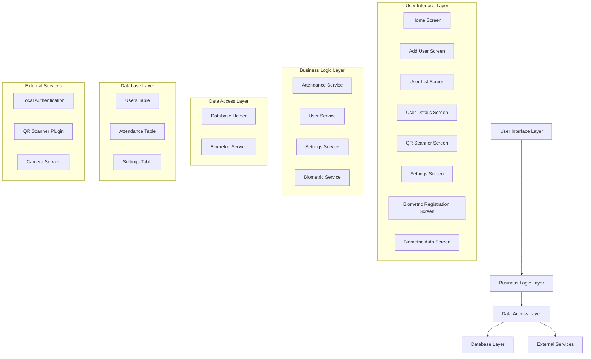

# Professional Attendance System

A comprehensive, enterprise-grade attendance management solution with advanced security features, biometric authentication, and configurable policies.


## 📋 Table of Contents
- [Overview](#overview)
- [Key Features](#key-features)
- [System Architecture](#system-architecture)
- [Technology Stack](#technology-stack)
- [Installation](#installation)
- [Usage](#usage)
- [Configuration](#configuration)
- [Security Features](#security-features)
- [Documentation](#documentation)
- [Contributing](#contributing)
- [License](#license)

## 📖 Overview

The Professional Attendance System is an upgraded version of a basic attendance application that transforms it into an enterprise-grade solution. This system provides enhanced security through biometric authentication, configurable policies for attendance management, and a professional user interface suitable for organizational use.

Originally designed as a simple QR code-based attendance system, this upgraded version now offers:

- **Automatic Employee ID Generation** with tamper-proof IDs
- **Admin-Configurable Time Settings** for flexible work schedules
- **Biometric Authentication** for secure attendance marking
- **Dual Authentication (QR + Biometric)** for enhanced security
- **Professional Dashboard** with real-time statistics

## 🚀 Key Features

### 🔐 Security & Authentication
- **Automatic ID Generation**: System-generated employee IDs that cannot be modified by users
- **Biometric Authentication**: Fingerprint and face recognition support
- **Dual Authentication**: QR code + biometric verification for critical operations
- **Immutable Records**: Tamper-proof attendance records

### ⚙️ Configurable Settings
- **Late Time Configuration**: Customizable time for marking late arrivals
- **Working Hours Management**: Define official work start/end times
- **Grace Period Settings**: Configurable buffer time before marking as late
- **ID Format Customization**: Define patterns for auto-generated employee IDs

### 📊 Professional Features
- **Real-time Dashboard**: Attendance statistics and employee overview
- **Comprehensive Reporting**: Detailed attendance records and analytics
- **Employee Management**: Complete profile management with photo support
- **Multi-department Support**: Organize employees by departments and positions

### 📱 User Experience
- **Intuitive Interface**: Modern, user-friendly design
- **QR Code Scanning**: Fast and reliable attendance marking
- **Biometric Registration**: Simple enrollment process for employees
- **Responsive Design**: Optimized for various device sizes

## 🏗️ System Architecture

The system follows a layered architecture pattern for maintainability and scalability:



For detailed architecture information, see [Architecture Diagram](architecture_diagram.md).

## 🛠️ Technology Stack

- **Frontend**: Flutter (Dart)
- **Database**: SQLite with sqflite package
- **Authentication**: local_auth for biometric verification
- **QR Scanning**: ultra_qr_scanner plugin
- **State Management**: Built-in Flutter state management
- **UI Components**: Material Design with custom theming

## 📦 Installation

### Prerequisites
- Flutter SDK 3.8.1 or higher
- Android Studio or Xcode for mobile development
- Android device or emulator (Android 6.0+)
- iOS device or simulator (iOS 10.0+)

### Setup Instructions

1. **Clone the repository**:
   ```bash
   git clone https://github.com/your-username/attendance-system.git
   cd attendance-system
   ```

2. **Install dependencies**:
   ```bash
   flutter pub get
   ```

3. **Configure platform-specific settings**:
   
   **For Android**:
   - Ensure camera permissions are granted
   - Enable biometric authentication in device settings

   **For iOS**:
   - Add camera usage description in Info.plist
   - Configure Face ID usage description

4. **Run the application**:
   ```bash
   flutter run
   ```

## 🎯 Usage

### For Administrators
1. **Access Settings**: Configure system parameters through the settings screen
2. **Manage Employees**: Add, edit, or remove employee records
3. **Monitor Attendance**: View real-time attendance statistics
4. **Configure Security**: Enable biometric or dual authentication

### For Employees
1. **Register Biometrics**: Enroll fingerprint or face recognition
2. **Mark Attendance**: Scan QR code or use biometric authentication
3. **View Records**: Check personal attendance history
4. **Update Profile**: Manage personal information

### Attendance Workflow
1. Open the application
2. Navigate to QR Scanner
3. Scan your employee QR code
4. If dual authentication is enabled, complete biometric verification
5. Receive confirmation of attendance marking

## ⚙️ Configuration

### Time Settings
- **Late Time**: Define when arrivals are considered late (default: 09:00:00)
- **Working Start Time**: Official work start time (default: 09:00:00)
- **Grace Period**: Minutes allowed after late time (default: 0 minutes)

### ID Settings
- **Auto-Generate IDs**: Enable/disable automatic ID generation
- **ID Format**: Customizable format (default: DEPTYYMMDD###)

### Security Settings
- **Biometric Authentication**: Require biometric verification for attendance
- **Dual Authentication**: Require both QR code and biometric verification

## 🔒 Security Features

### Data Protection
- **Encrypted Storage**: Sensitive data stored securely
- **Tamper-Proof IDs**: System-generated IDs cannot be modified
- **Access Controls**: Role-based permissions for different user types

### Authentication Methods
- **QR Code Verification**: Standard attendance marking method
- **Biometric Authentication**: Fingerprint and face recognition
- **Dual-Factor Authentication**: Combination of QR code and biometrics

### Audit & Compliance
- **Complete Audit Trail**: All actions logged for compliance
- **Immutable Records**: Attendance records cannot be altered
- **Administrative Oversight**: Full visibility for authorized personnel

## 📚 Documentation

Detailed documentation is available in the following files:

- [Feature Specification](feature_specification.md) - Complete feature requirements and specifications
- [Architecture Diagram](architecture_diagram.md) - Detailed system architecture and component relationships
- [Upgrade Summary](upgrade_summary.md) - Comprehensive overview of enhancements made

### API Documentation
All data models and services are well-documented in the codebase:
- **Models**: Located in `lib/models/`
- **Services**: Located in `lib/services/`
- **Screens**: Located in `lib/screens/`

## 🤝 Contributing

Contributions are welcome! Here's how you can contribute:

1. Fork the repository
2. Create a feature branch (`git checkout -b feature/AmazingFeature`)
3. Commit your changes (`git commit -m 'Add some AmazingFeature'`)
4. Push to the branch (`git push origin feature/AmazingFeature`)
5. Open a Pull Request

Please ensure your code follows the existing style and includes appropriate tests.

## 📄 License

This project is licensed under the MIT License - see the [LICENSE](LICENSE) file for details.

## 📞 Support

For support, please open an issue on the GitHub repository or contact the development team.

## 🙏 Acknowledgments

- Thanks to all contributors who have helped shape this project
- QR scanning functionality powered by the ultra_qr_scanner plugin
- Biometric authentication enabled by the local_auth package
- UI components built with Flutter's Material Design

---

<p align="center">
  <strong>Professional Attendance System</strong> • Built with ❤️ using Flutter
</p>
