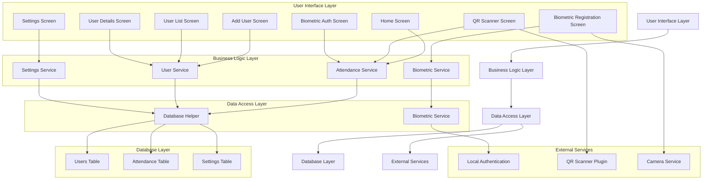

# Professional Attendance System - Architecture Diagram

## Overview
This document provides a visual representation of the upgraded attendance system architecture, showing the relationships between components and data flow.

## System Architecture

## Component Descriptions

### User Interface Layer
The presentation layer that users interact with directly.

#### Home Screen
- Main dashboard with quick actions
- System overview and statistics
- Navigation to other screens

#### Add User Screen
- Employee registration interface
- Automatic ID generation
- Profile information management

#### User List Screen
- Employee directory
- Search and filtering capabilities
- Bulk management operations

#### User Details Screen
- Comprehensive employee information
- Attendance history view
- Biometric registration access

#### QR Scanner Screen
- Attendance marking interface
- QR code scanning functionality
- Dual authentication integration

#### Settings Screen
- Administrative configuration
- Time settings management
- Security policy configuration

#### Biometric Registration Screen
- Employee biometric enrollment
- Device capability checking
- Registration status feedback

#### Biometric Auth Screen
- Biometric authentication interface
- Attendance marking workflow
- Success/error feedback

### Business Logic Layer
The core services that implement business rules and logic.

#### Attendance Service
- Attendance marking logic
- Late time calculation
- Check-in/check-out processing

#### User Service
- Employee management operations
- Profile data handling
- User validation

#### Settings Service
- Configuration management
- System parameter retrieval
- Settings persistence

#### Biometric Service
- Biometric authentication operations
- Device capability checking
- Authentication workflow management

### Data Access Layer
The data access components that interface with storage and external services.

#### Database Helper
- Database operations abstraction
- CRUD operations for all entities
- Connection management

#### Biometric Service
- Biometric authentication interface
- Local authentication integration
- Security protocol implementation

### Database Layer
The persistent storage layer.

#### Users Table
- Employee profile information
- System-generated ID flags
- Biometric registration status

#### Attendance Table
- Attendance records
- Check-in/check-out times
- Status information

#### Settings Table
- System configuration parameters
- Time settings
- Security policy configurations

### External Services
Third-party services and device capabilities.

#### Local Authentication
- Biometric authentication framework
- Device security integration
- Authentication protocol handling

#### QR Scanner Plugin
- QR code scanning functionality
- Camera interface
- Code detection and processing

#### Camera Service
- Camera hardware access
- Image capture capabilities
- Device integration

## Data Flow

### Employee Registration Flow
1. User accesses Add User Screen
2. System generates unique employee ID
3. User enters profile information
4. Data validated through User Service
5. Information stored in Users Table
6. Success confirmation displayed

### Attendance Marking Flow
1. User accesses QR Scanner Screen
2. QR code scanned and decoded
3. Employee ID validated
4. Settings retrieved for late time configuration
5. If dual auth enabled:
   - Navigate to Biometric Auth Screen
   - Perform biometric authentication
6. Attendance record created/updated
7. Success feedback provided

### Biometric Registration Flow
1. User accesses Biometric Registration Screen
2. Device capabilities checked
3. User guided through enrollment process
4. Biometric data captured and stored
5. Registration confirmation provided

### Settings Management Flow
1. Admin accesses Settings Screen
2. Current configuration retrieved
3. Changes made through UI controls
4. Validation performed on inputs
5. Updated settings stored
6. Confirmation provided

## Security Architecture

### Data Protection
- Immutable system-generated IDs
- Encrypted storage of sensitive data
- Secure transmission protocols

### Authentication
- QR code verification
- Biometric authentication
- Dual-factor authentication options

### Access Control
- Role-based permissions
- Administrative override capabilities
- Audit trail maintenance

## Integration Points

### Internal Integrations
- Database operations
- UI component interactions
- Service-to-service communication

### External Integrations
- Device biometric sensors
- Camera hardware
- QR code scanning libraries

## Scalability Considerations

### Database Design
- Indexed tables for performance
- Normalized data structure
- Efficient query patterns

### Service Architecture
- Stateless service design
- Caching strategies
- Load distribution

## Maintenance Architecture

### Update Management
- Database migration support
- Configuration versioning
- Backward compatibility

### Monitoring
- Usage analytics
- Error tracking
- Performance metrics

## Conclusion

This architecture diagram illustrates a robust, scalable, and secure attendance system that incorporates modern best practices in mobile application development. The layered approach provides clear separation of concerns while enabling future enhancements and integrations.